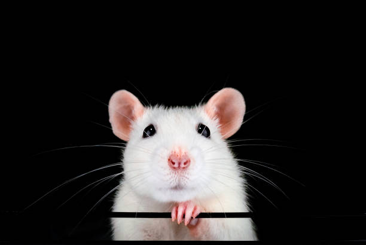
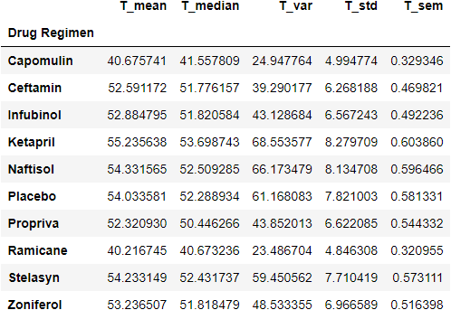
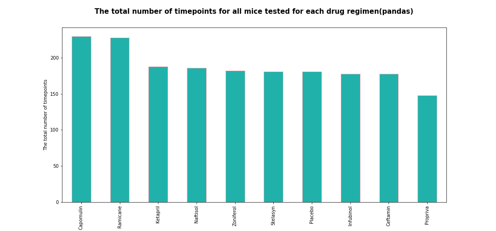
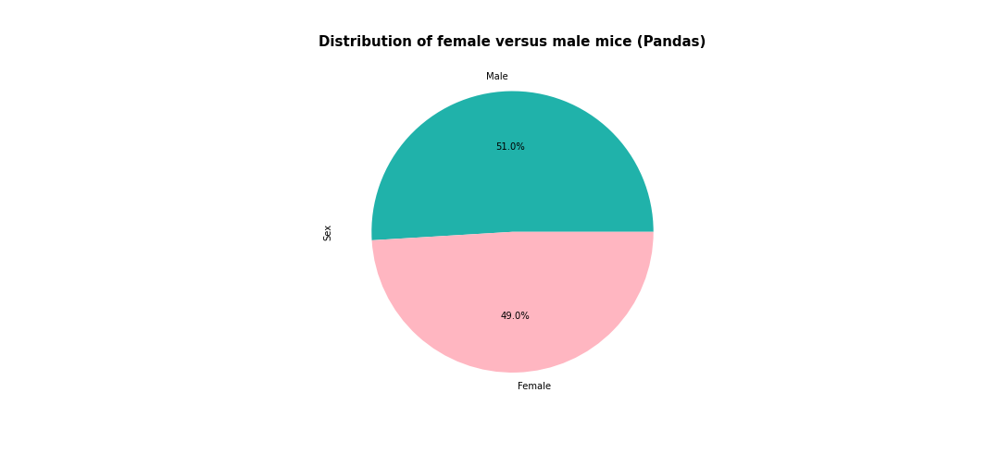
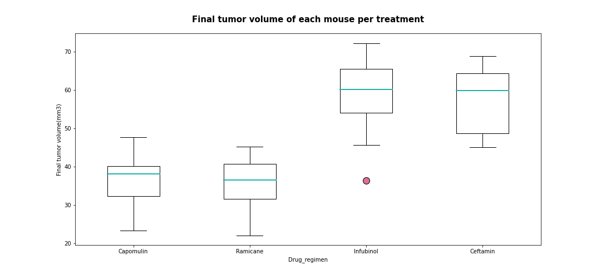
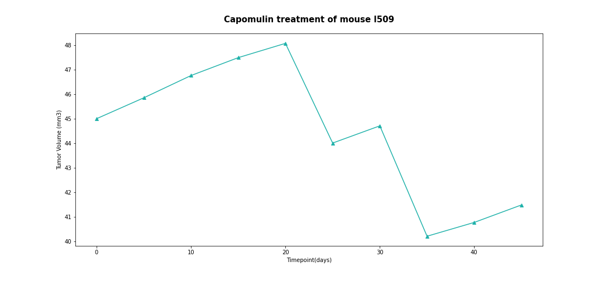
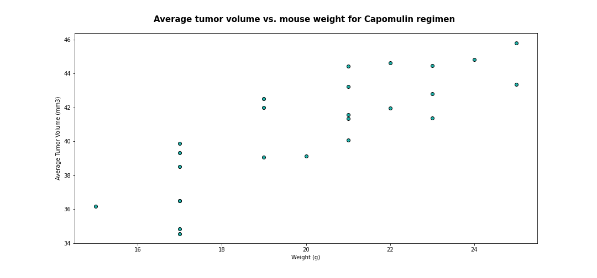
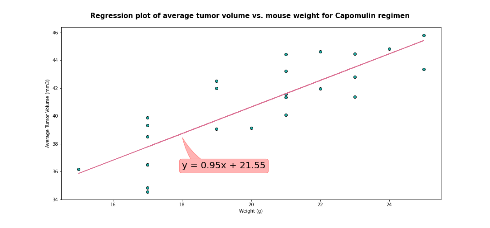

# The-Power-of-Plots
## Background

What good is data without a good plot to tell the story?

While your data companions rushed off to jobs in finance and government, you remained adamant that science was the way for you. Staying true to your mission, you've joined Pymaceuticals Inc., a burgeoning pharmaceutical company based out of San Diego. Pymaceuticals specializes in anti-cancer pharmaceuticals. In its most recent efforts, it began screening for potential treatments for squamous cell carcinoma (SCC), a commonly occurring form of skin cancer.

As a senior data analyst at the company, you've been given access to the complete data from their most recent animal study. In this study, 249 mice identified with SCC tumor growth were treated through a variety of drug regimens. Over the course of 45 days, tumor development was observed and measured. The purpose of this study was to compare the performance of Pymaceuticals' drug of interest, Capomulin, versus the other treatment regimens. You have been tasked by the executive team to generate all of the tables and figures needed for the technical report of the study. The executive team also has asked for a top-level summary of the study results.

### Initial Preparation

* Run the provided package dependency and data imports, then merge the `mouse_metadata` and `study_results` DataFrames into a single DataFrame.

* Display the number of unique mice IDs in the data, then check for any mouse ID with duplicate time points. Display the data associated with that mouse ID, then create a new DataFrame where this data is removed. 

* Use this cleaned DataFrame for the remaining steps.

* Display the updated number of unique mice IDs.

### Summary Statistics

* Create two summary statistics tables:

    * For the first table, use the `groupby` method to generate the mean, median, variance, standard deviation, and SEM of the tumor volume for each drug regimen. This should result in five unique series objects. Combine these objects into a single summary statistics table.
    * For the second table, use the `agg` method to produce the same summary statistics table using a single line of code.

### Bar and Pie Charts

* Generate two bar plots:

    * Both of these plots should be identical and should show the total number of timepoints for all mice tested for each drug regimen throughout the course of the study.
    * Create the first bar plot using Pandas's `DataFrame.plot()` method.
    * Create the second bar plot using Matplotlib's `pyplot` methods.

* Generate two pie plots:

    * Both of these plots should be identical and should show the distribution of female or male mice in the study.
    * Create the first pie plot using both Pandas's `DataFrame.plot()`.
    * Create the second pie plot using Matplotlib's `pyplot` methods.

### Quartiles, Outliers and Boxplots

* Calculate the final tumor volume of each mouse across four of the most promising treatment regimens: Capomulin, Ramicane, Infubinol, and Ceftamin. Calculate the quartiles and IQR and quantitatively determine if there are any potential outliers across all four treatment regimens.

    * Start by creating a grouped DataFrame that shows the last (greatest) time point for each mouse, then merge this grouped DataFrame with the original cleaned DataFrame.
    * Next, create a list that holds the treatment names, as well as a second, empty list that will hold the tumor volume data.
    * Loop through each drug in the treatment list, locating the rows in the merged DataFrame that correspond to each treatment. Append the resulting final tumor volumes for each drug to the empty list. Determine outliers using the upper and lower bounds, then print the results.
    
* Using Matplotlib, generate a box and whisker plot of the final tumor volume for all four treatment regimens and highlight any potential outliers in the plot by changing their color and style.

  **Hint**: All four box plots should be within the same figure. Use this [Matplotlib documentation page](https://matplotlib.org/gallery/pyplots/boxplot_demo_pyplot.html#sphx-glr-gallery-pyplots-boxplot-demo-pyplot-py) for help with changing the style of the outliers.

### Line and Scatter Plots

* Select a mouse that was treated with Capomulin and generate a line plot of tumor volume vs. time point for that mouse.

* Generate a scatter plot of tumor volume versus mouse weight for the Capomulin treatment regimen.

### Correlation and Regression

* Calculate the correlation coefficient and linear regression model between mouse weight and average tumor volume for the Capomulin treatment. Plot the linear regression model on top of the previous scatter plot.

### Final Analysis

* Look across all previously generated figures and tables and write at least three observations or inferences that can be made from the data. Include these observations at the top of the notebook.

## Hints and Considerations

* Be warned: These are very challenging tasks. Be patient with yourself as you trudge through these problems. They will take time and there is no shame in fumbling along the way. Data visualization is equal parts exploration, equal parts resolution.

* You have been provided a starter notebook. Use the code comments as a reminder of steps to follow as you complete the assignment.

* You must use proper labeling of your plots, to include properties such as: plot titles, axis labels, legend labels, _x_-axis and _y_-axis limits, etc.

* Don't get bogged down in small details. Always focus on the big picture. If you can't figure out how to get a label to show up correctly, come back to it. Focus on getting the core skeleton of your notebook complete. You can always revisit old problems.

* While you are trying to complete this assignment, feel encouraged to constantly refer to Stack Overflow and the Pandas documentation. These are needed tools in every data analyst's tool belt.

* Remember, there are many ways to approach a data problem. The key is to break up your task into micro tasks. Try answering questions like:

  * How does my DataFrame need to be structured for me to have the right _x_-axis and _y_-axis?

  * How do I build a basic scatter plot?

  * How do I add a label to that scatter plot?

  * Where would the labels for that scatter plot come from?

  Again, don't let the magnitude of a programming task scare you off. Ultimately, every programming problem boils down to a handful of bite-sized tasks.

* Get help when you need it! There is never any shame in asking. But, as always, ask a _specific_ question. You'll never get a great answer to "I'm lost."

## Rubric

[Unit 5 Rubric - Matplotlib Homework - The Power of Plots](https://docs.google.com/document/d/1ZZ0lFGHqKwVdqjTCfynY2FSiswuOMBVi9An7oWeg344/edit?usp=sharing)

- - -

## References

Mockaroo, LLC. (2021). Realistic Data Generator. [https://www.mockaroo.com/](https://www.mockaroo.com/)

- - -

© 2021 Trilogy Education Services, LLC, a 2U, Inc. brand. Confidential and Proprietary. All Rights Reserved.

